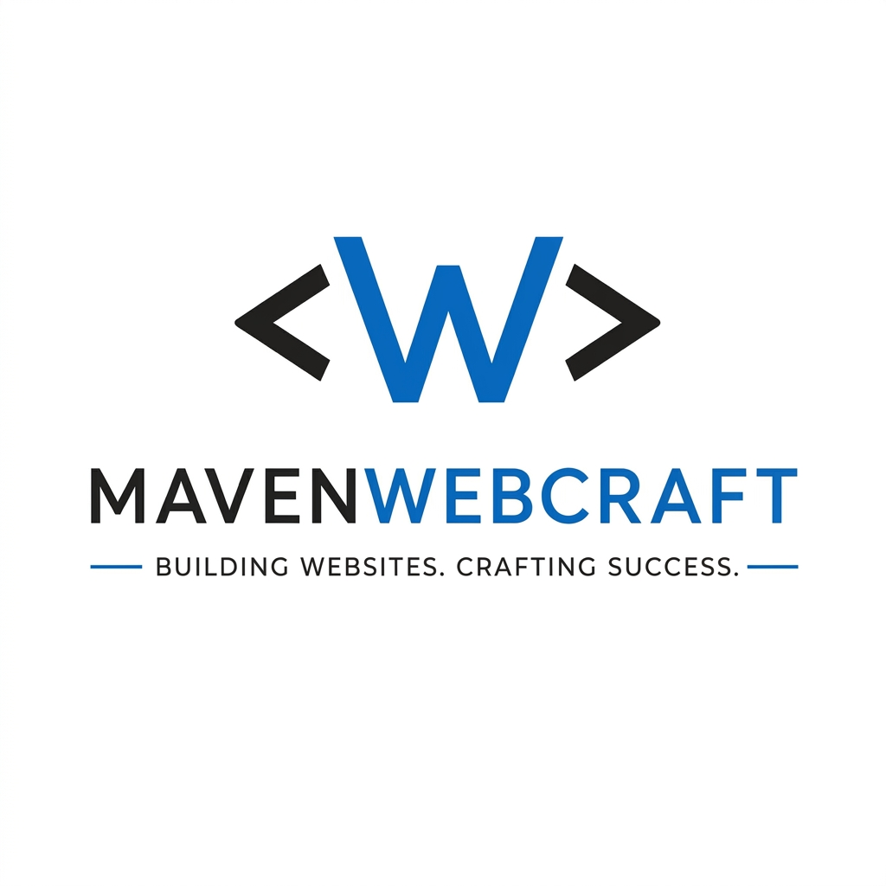
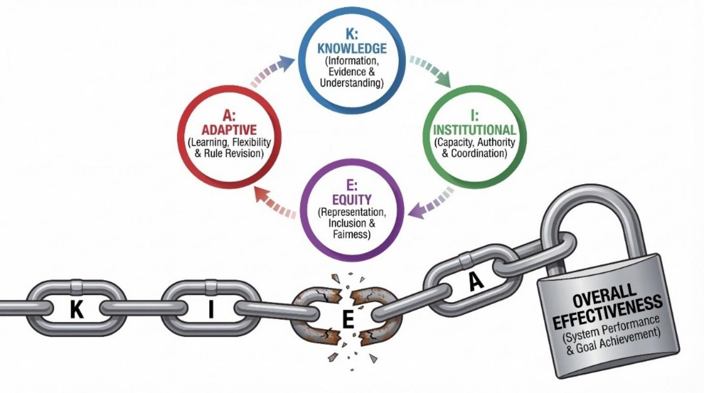
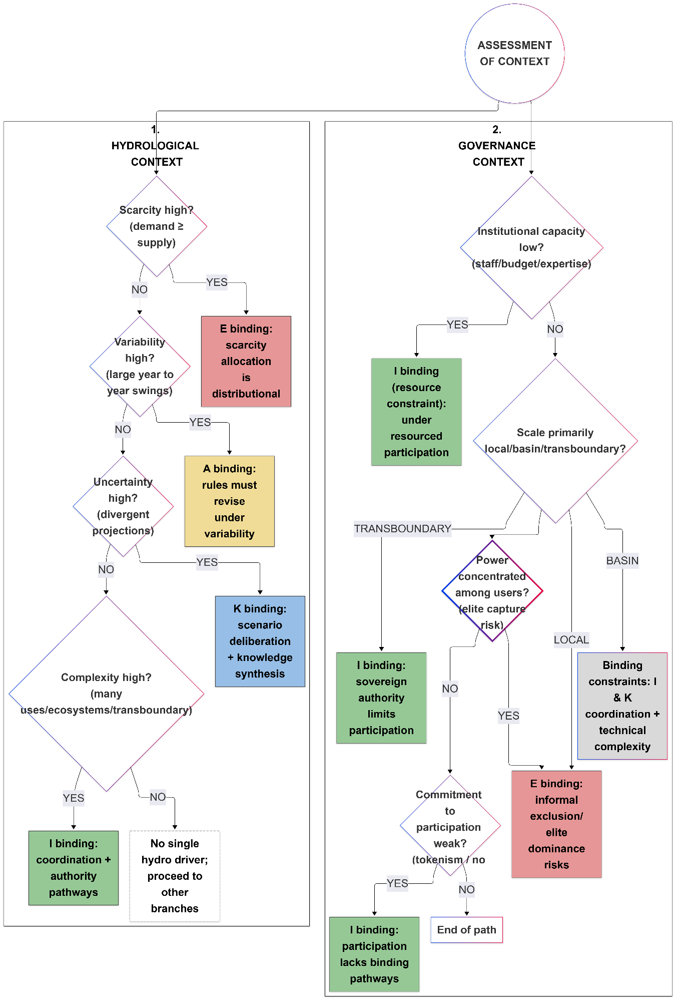
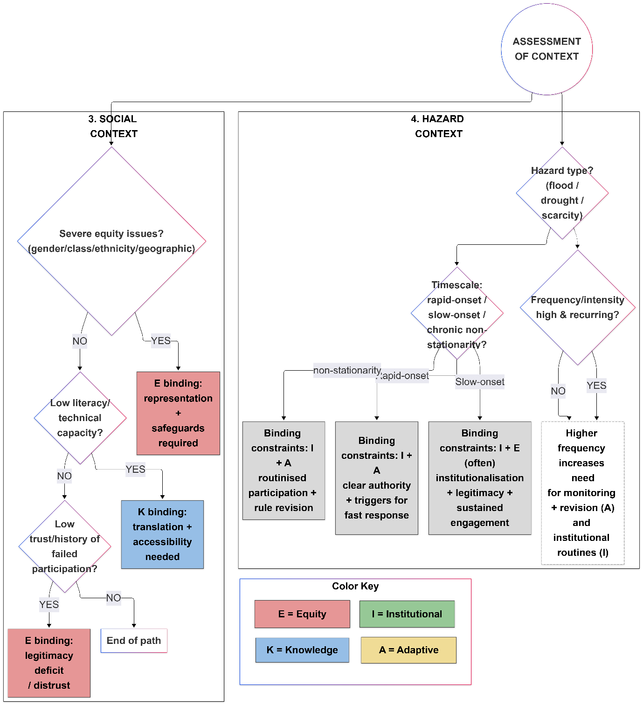

<p align="center">
  <a href="https://mavenwebcraft.com">
    
  </a>
</p>

<h1 align="center">
   Hey there, I'm <strong>Masood Sultan</strong>
</h1>

<p align="center">
  <a href="https://www.linkedin.com/in/masood1996/"></a>
  <a href="mailto:masood.geo@yahoo.com"></a>
  <a href="https://github.com/masood1996-geo"></a>
</p>

<p align="center">
  
</p>

---

## 🧬 About Me

```yaml
name:       Masood Sultan
role:       Geoscientist & AI Developer
education:  MSc Global Change Geography — Humboldt University of Berlin (Grade: 2.1)
focus:      Earth Sciences × Artificial Intelligence × Automation
location:   Berlin, Germany 🇩🇪
```

I'm a **Geoscientist** with a passion for building intelligent automation tools. My work sits at the intersection of **Earth Sciences**, **AI/LLM technologies**, and **full-stack development**. I specialize in taking complex, manual workflows and turning them into sleek, automated pipelines.

- 🌐 Check out my **[Personal Website & Portfolio](https://masoodsultan.com)**
- ☕ View my **[Barista Portfolio](https://barista.masoodsultan.com)** and **[Blog](https://blog.masoodsultan.com)**
- 🔭 Currently building **autonomous web agents**
- ✨ Finished **[TerraMind Core](https://github.com/masood1996-geo/terramind-core)** (Global Disaster Intelligence Platform)
- 🤝 Built **[Kindly Berlin](https://kindly.berlin)**, **[Café Zwei Freunde](https://zweifreunde.cafe/)**, and **[Shareekat-ul-Hussain](https://www.shareekatulhussain.com/)** (Business & community sites)
- 🌱 Pursuing opportunities in **climate modeling**, **AI weather prediction**, and **computational geoscience**
- 🎓 **MSc** in Global Change Geography from **Humboldt University of Berlin** (Grade 2.1)
- 🎓 **BSc** in Geophysics from **Bahria University** (CGPA 3.55/4.00)
- 🏆 **3rd Runner-up** — Imperial Barrel Awards, Asia Pacific Region (AAPG)

---

## 💼 Agency & Services

I am the co-founder and lead engineer of **[Maven Webcraft](https://mavenwebcraft.com)**, a modern web development agency specializing in crafting premium, dynamic, and high-performance digital experiences. 

**Core Services Provided:**
- **Full-Stack Web Development:** Building scalable applications with modern frontend frameworks and robust backends.
- **Premium UI/UX Design:** Delivering rich aesthetics with modern typography, custom styling, and engaging micro-animations.
- **Technical SEO:** Implementing best practices to ensure high visibility, optimized metadata, and strong search engine indexing.
- **Custom Business Solutions:** Delivering tailored digital platforms—from dynamic interactive sites to comprehensive data tools.

---

## 🛠️ Tech Stack

<table>
<tr>
<td valign="top" width="33%">

### 💻 Languages


</td>
<td valign="top" width="33%">

### 🤖 AI & Data


</td>
<td valign="top" width="33%">

### 🌍 Geosciences


</td>
</tr>
<tr>
<td valign="top" width="33%">

### 🔧 Dev Tools


</td>
<td valign="top" width="33%">

### 🧠 AI Tools


</td>
<td valign="top" width="33%">

### 🗣️ Languages


</td>
</tr>
</table>

---

## 🚀 Featured Projects

<a href="https://github.com/masood1996-geo/terramind-core">
  
</a>
<a href="https://github.com/masood1996-geo/openhouse-bot">
  
</a>
<a href="https://github.com/masood1996-geo/ai-scraper">
  
</a>

---

## 📊 GitHub Stats

<p align="center">
  
  
</p>

<p align="center">
  
</p>

---

## 🎓 Education & Research

| Degree | Field | Institution | Year |
|--------|-------|-------------|------|
| 🎓 **MSc** | Global Change Geography | Humboldt University of Berlin 🇩🇪 (Grade: 2.1) | 2019–2026 |
| 🎓 **BSc** | Geophysics | Bahria University Karachi 🇵🇰 | 2014–2018 |

### 📄 Research
- 🗺️ **3D Geomodelling Case Study** — *A case study of 3D geomodelling of Frontier Formation Second Wall Creek Sand, Teapot Dome, Wyoming, USA*. Published in the **Journal of Applied Geophysics**. [DOI: 10.1016/j.jappgeo.2020.104114](https://doi.org/10.1016/j.jappgeo.2020.104114) *(Completed)*
- 💧 **Rebound Effect** — Water supply & demand in the United States *(In Progress)*

### 📖 Master's Thesis: The KIEA Framework for Adaptive Water Governance
**Title:** *A Critical Review of Participatory Approaches in Water Management for Climate Change Adaptation*

My primary contribution to the field of Global Change Geography is the **Conditional Enabling Framework (KIEA)**, developed to diagnose and evaluate participatory water governance under severe climate stress and hydrological non-stationarity. Traditional models assume participation uniformly yields positive outcomes—my research demonstrates that participation often devolves into tokenism or elite capture unless four interdependent enabling conditions are met simultaneously.

#### The Four Dimensions of KIEA:
1. 🧠 **Knowledge Performance (K):** Diverse evidence (scientific and local) must be integrated, validated, and readily accessible for time-sensitive decision-making. 
2. 🏛️ **Institutional Performance (I):** Participatory outputs must maintain authoritative influence and translate into binding decisions rather than being restricted to symbolic consultation.
3. ⚖️ **Equity Performance (E):** Robust procedural safeguards must ensure meaningful representation, protecting marginalized communities from elite domination or disproportionate resource burdens.
4. 🔄 **Adaptive Performance (A):** The system must support iterative rule revision, ongoing monitoring, and continuous adaptation as climatic baselines drastically shift over time.

<p align="center">
  
  <br><em>Figure: The KIEA Dimensions. Following "binding constraint logic," the weakest dimension strictly limits overall governance effectiveness.</em>
</p>

#### Diagnostic Pathways & Binding Constraint Logic
Instead of universally expanding participation platforms, the framework insists that policy interventions must surgically target the *binding constraint*. I developed comprehensive diagnostic pathways detailing how hydrological regimes, governance scales, institutional limitations, and hazard types condition exactly which K, I, E, or A dimension will inevitably fail first.

<p align="center">
  
  
  <br><em>Figures: Step-by-step diagnostic pathways translating Hydrological, Governance, Social, and Hazard contexts directly into their corresponding binding constraints.</em>
</p>

Through a realist synthesis of 121 global water management studies, this diagnostic instrument directly shifts theoretical climate governance toward measurable, actionable, and prescriptive implementation.

---

## 🏅 Awards & Achievements

- 🥉 **3rd Runner-up** — Imperial Barrel Awards, Asia Pacific Region (AAPG)
- 🏆 **Rector Honor Award** — Bahria University Karachi (2014–2018)
- ⚓ **Behr-e-Paima Survey Vessel Boarding** — Pakistan Navy (2015)
- 🎖️ **Multiple Merit Scholarships**

---

## 🤝 Professional Memberships

| Organization | Role |
|--------------|------|
| Pakistan Association of Petroleum Geoscientist (PAPG) | 🎓 Student Vice President |
| American Association of Petroleum Geologist (AAPG) | 📋 Student Member |
| Society of Exploration Geophysicist (SEG) | 💰 Student Treasurer |
| HOPE (Help Of Patients In Exigency By Students) | 🌟 Ambassador |

---

## 📈 Activity Graph

[](https://github.com/masood1996-geo)

---

<p align="center">
  
</p>

<p align="center">
  <em>🌍 Bridging Earth Sciences and AI — one commit at a time.</em>
</p>
